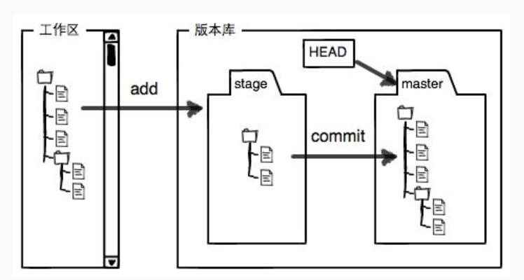

**查看当前仓库状态status** ：判断下一步该执行 `git add`（暂存）、`git commit`（提交），还是其他操作
```bash
git status
```
**查看差异difference**
```bash
git diff readme.txt 
```
- 未 `add` 时：`git diff` 对比「工作区最新状态」vs「上一次 `commit` 版本」（中间修改多少次都合并显示）；
- 已 `add` 时：默认 `git diff` 对比「工作区最新状态」vs「上一次 `add` 暂存版本」（只显示 `add` 后的新增修改）；
- 想始终对比「工作区最新状态」与「上一次 `commit` 版本」：用 `git diff HEAD 文件名`，不管中间有没有 `add`，都能看到所有修改和 `commit` 版本的差异。
- git diff --cached	上一次 add 暂存版本 ↔ 上一次 commit 版本
- 结果解读，为了注释，这里用Python格式
```python
diff --git a/readme.txt b/readme.txt # 表示对比的是 readme.txt 的两个版本 ——a/ 是「原版本」（版本库中最新提交的旧版本），b/ 是「修改后的版本」（你当前工作区的新版本）
index 46d49bf..9247db6 100644 

--- a/readme.txt # --- 代表「原版本文件」（旧内容）；
+++ b/readme.txt # +++ 代表「修改后的版本文件」（新内容）
@@ -1,2 +1,2 @@ # -1,2 表示「原版本从第 1 行开始，共 2 行」；+1,2 表示「修改后的版本从第 1 行开始，共 2 行」；
-Git is a version control system.
+Git is a distributed version control system.
 Git is free software.
'''
- 带 - 号的行：「原版本删除的内容」（旧第 1 行）；
- 带 + 号的行：「新版本新增的内容」（新第 1 行）；
- 没有前缀的行：「未修改的公共内容」（第 2 行，原封不动）
''' 
```

**查看提交历史**:显示当前仓库的所有提交记录
```bash
git log
```
- 结果如下
```python
commit 1094adb7b9b3807259d8cb349e7df1d4d6477073 (HEAD -> master)
Author: Michael Liao <askxuefeng@gmail.com>
Date:   Fri May 18 21:06:15 2018 +0800

    append GPL

commit e475afc93c209a690c39c13a46716e8fa000c366
Author: Michael Liao <askxuefeng@gmail.com>
Date:   Fri May 18 21:03:36 2018 +0800

    add distributed

commit eaadf4e385e865d25c48e7ca9c8395c3f7dfaef0
Author: Michael Liao <askxuefeng@gmail.com>
Date:   Fri May 18 20:59:18 2018 +0800

    wrote a readme file
    
'''
执行 git log 后，会按「时间倒序」（最新提交在最上面）显示所有提交，每条提交包含以下关键信息：
提交哈希值（40 位字符，如 57ab539f82d464919e199213cc4999999999999）：该提交的唯一标识，用于回滚、对比版本；
作者信息（姓名 + 邮箱）：谁提交的（对应你之前配置的 user.name 和 user.email）；
提交时间：什么时候提交的（精确到分钟 / 秒）；
提交信息：你通过 git commit -m "xxx" 写的说明（比如「add distributed」「修改 readme 文档」），解释这次提交的目的。
'''
```
- 或者直接git log --pretty=oneline 或者 git log --oneline 

```bash
$ git log --pretty=oneline # 也可以git log --oneline
1094adb7b9b3807259d8cb349e7df1d4d6477073 (HEAD -> master) append GPL
e475afc93c209a690c39c13a46716e8fa000c366 add distributed
eaadf4e385e865d25c48e7ca9c8395c3f7dfaef0 wrote a readme file
```

# **版本回退**
- 在Git中，**用`HEAD`表示当前版本**，也就是最新的提交`1094adb...`
- 上一个版本就是`HEAD^`，上上一个版本就是`HEAD^^`，当然往上100个版本写100个`^`比较容易数不过来，所以写成`HEAD~100`
```bash
git reset --hard HEAD^
git reset --hard e475afc # 也可以用哈希值回退到指定版本，当然也可以回退到被撤销的版本，只需提前记住被撤销版本的哈希值
```
- **`--soft` 只动版本库，`--mixed` 动版本库 + 暂存区，`--hard` 动版本库 + 暂存区 + 工作区**

**查看本地仓库中 `HEAD` 指针的所有移动记录**
```bash
git relog
```

```bash
e475afc HEAD@{1}: reset: moving to HEAD^  # 操作1（最新）：执行了 git reset，把 HEAD 移到了 HEAD^（上一个版本）
1094adb (HEAD -> master) HEAD@{2}: commit: append GPL  # 操作2：执行了 git commit，提交说明是“append GPL”，版本号 1094adb
e475afc HEAD@{3}: commit: add distributed  # 操作3：执行了 git commit，提交说明是“add distributed”，版本号 e475afc
eaadf4e HEAD@{4}: commit (initial): wrote a readme file  # 操作4（最早）：首次提交，提交说明是“wrote a readme file”，版本号 eaadf4e

# e475afc	操作后 HEAD 指向的「版本号」（哈希值前 7 位）
```

# 工作区、暂存区、版本库
**工作区（Working Directory）**：就是在电脑里能看到的目录，比如`learngit`文件夹就是一个工作区：
**版本库（Repository）**：也叫做仓库，即工作区中的隐藏目录`.git`
- 执行 `git commit` 后，暂存区的所有文件会被打包成一个「提交对象」，正式存入这里（永久保存，可通过 `git log` 查看所有提交记录）
**暂存区**：版本库中的叫stage（或者叫index）的暂存区，本质是 `.git` 目录下的一个名为 `index` 的文件。**暂存区存储是 “要提交的修改（变更）操作，而非文件本身”**
版本库中还有Git为我们自动创建的第一个**分支**`master`，以及指向`master`的一个**指针**叫`HEAD`
 在「没有执行 `git add`」且「没有未提交的暂存内容」时，**暂存区和版本库是完全一致的**，而且工作区的修改不影响暂存区和版本库的同步状态
**提交（commit）的目标就是把暂存区的内容 “存入版本库”**




# 撤销修改
**场景1**：当你改乱了工作区某个文件的内容，想直接丢弃工作区的修改时（没有git add），用命令`git checkout -- file`。
`git checkout -- <file>` 的本质是**“用暂存区覆盖工作区”**。如果暂存区是空的（没 add 过），它就默认用上一次 commit 的内容来覆盖。
```bash
git checkout -- readme.txt
```
**场景2**：当你不但改乱了工作区某个文件的内容，还git add添加到了暂存区时，想丢弃修改，分两步，第一步用命令`git reset HEAD <file>`，就回到了场景1，第二步按场景1操作。
```bash
git reset HEAD readme.txt # 把readme.txt从暂存区撤回到「工作区」
git checkout -- readme.txt

# 或者直接
git checkout HEAD -- readme.txt
```
**场景3**：已经提交了不合适的修改到版本库时，想要撤销本次提交，参考[版本回退](https://liaoxuefeng.com/books/git/time-travel/reset/index.html)一节，不过前提是没有推送到远程库。
- **git checkout -- file 只修改「工作区」，「暂存区」和「版本库」的内容完全不变**
- 文件已执行 git add（在暂存区有版本）：用「暂存区的文件版本」覆盖工作区 —— 比如你修改后 git add 了，又改乱了工作区，执行后会工作区内容恢复到 git add 时的状态；
- 文件未执行 git add（暂存区无新版本）：用「版本库最新 commit 的文件版本」覆盖工作区 —— 比如只修改了工作区，没暂存，执行后会恢复到上一次 commit 的状态。
- 在「没有执行 `git add`」且「没有未提交的暂存内容」时，**暂存区和版本库是完全一致的**，而且工作区的修改不影响暂存区和版本库的同步状态

# 删除文件
想要删除版本库中的文件
```bash
git rm test.txt
git commit -m "remove test.txt"
```
注意git rm test.txt等价于rm test.txt + git add test.txt
`git rm` 是 “删除 + 暂存” 的快捷命令，`rm + git add` 是分步实现的等价操作
rm test.txt 只是删除了工作区的文件，对暂存区和版本库无影响
